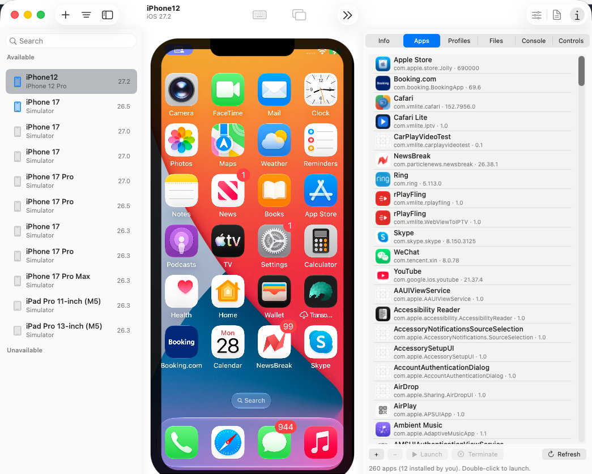

# rPlayHub

An open-source, **cross-platform alternative to Apple's Device Hub**. Mirror and control an
iPhone from **macOS or Linux** — live screen, click-to-tap, drag-to-swipe, app and profile
management, crash reports and the device's own settings.

Apple's Device Hub ships inside Xcode and runs on macOS only. rPlayHub is a from-scratch
**CoreDevice host**: it speaks the protocol directly, so there is **no Xcode and no Apple daemon
in the runtime path**, and the same engine drives a native macOS app or a Linux GUI. Think of it
as **`adb` for iPhone**. It is a development tool, not a consumer product.



## Download

A signed and notarized DMG is on the [releases page](https://github.com/rPlayAI/rPlayHub/releases).
macOS 14 or later, Apple silicon. Open it and drag rPlayHub to Applications.

The app talks to a small engine (`cdhost`) that it starts for you. Building that from source is
covered in [BUILD.md](BUILD.md).

## Where it is, and where it is going

Working today, and what the DMG above ships:

- **Live mirroring and control** — HEVC screen video over the CoreDevice tunnel, with clicks and
  drags mapped to the device's own coordinate space.
- **Device management** — install and remove apps and configuration profiles, browse the Media
  partition, read crash reports, spins and logs, stream the console.
- **Device settings** — appearance, text size, reduce motion, VoiceOver, simulated location and
  the rest, read and written live.
- **Linux** — the same engine behind a Dear ImGui front-end (`client-c/`), built in CI on every
  push. Less polished than the macOS app; the protocol underneath is the same.

Planned, and past what Device Hub does:

- **Sensor-aware viewing** — orientation and motion from the device, not just its framebuffer.
- **3D viewing** — the phone as a model you can tilt, driven by live sensor data.
- **`adb`-shaped client/server** — one long-running server keeping tunnels warm across many
  devices, with a thin CLI and the GUIs as clients.
- **Remote iPhone** — a phone on another network usable from here.

A note on the first two: CoreDevice exposes no sensor telemetry — screen, HID, apps, profiles and
logs, but nothing from the IMU. Those features therefore need a small companion app on the device
feeding data back over the tunnel. That stays **optional**: without it everything above still
works, and the host-side tool keeps needing nothing installed on the phone.

## Languages

- **Swift** — the macOS app and its View Screen window (`app/`, an Xcode project).
- **C / C++** — the portable protocol core (`host-c/`).
- **Python** (`host/`) — prototyping and verification harness only. Wire formats get proven here
  against a real phone before being committed to in C or Swift. Not a shipping artifact — though
  `host/mirror.py` is currently also the engine the app talks to.

Shipped as a **Developer ID signed, notarized DMG** from our own site. The Mac App Store is not
possible with the current design: a sandboxed app cannot create the `utun` interface the tunnel
needs, cannot install a privileged helper, and has no entitlement for `/var/run/usbmuxd`.
`app/DISTRIBUTION.md` records what would change that — a userspace TCP stack plus the RemotePairing
transport, both of which we want anyway.

CarPlay is not part of this project; it was only where the earliest experiments happened.

## Layout

`app/` is split by subsystem, third-party code lives in `deps/`, tooling in `scripts/`.

- **`app/`** — **rPlayHub**, the native macOS app: an Xcode project, Swift + AppKit, live View Screen
  with click-to-tap. Builds clean; shipped as a notarized DMG. See `app/README.md`,
  `app/DISTRIBUTION.md`, `app/PORTING.md`, and `app/api/PROTOCOL.md`.
- **`host/`** — Python engine and harness. `mirror.py` is the live mirror + control engine; the flat
  modules are the verified protocol implementation. Start with `host/README.md`.
- **`core/`** — the **portable video and input path** in C: Annex-B parsing, H.264/HEVC
  classification, access-unit assembly, keyframe gating, and coordinate mapping, with
  `hwdecoder.h` as the platform decoder seam (VideoToolbox on macOS, ffmpeg/SDL on Linux and
  Windows). `make -C core test` runs its tests against real recordings.
- **`host-c/`** — the C host: usbmux and lockdown so far.
- **`scripts/`** — `package-dmg.sh` (build + sign + notarize), `mock_engine.py` (replay a recording
  as if it were the engine, so the app can be developed with no phone and no root),
  `mirror_check.py` (verify a running engine).
- **`doc/`** — protocol RE: `REMOTEPAIRING-PROTOCOL.md`, `COREDEVICE-SCREEN-STREAMING.md`.
- **`AGENTS.md`** — paste into a new AI session to continue.

## Quick start

The app plus the engine — this is the product:

```
sudo python3 host/mirror.py <udid>       # engine (needs root for the tunnel): :9877 video, :9876 control
xcodebuild -project app/rPlayHub.xcodeproj -scheme rPlayHub build && \
  open build/DerivedData/Build/Products/Debug/rPlayHub.app
```

Start them in either order — the app retries and shows what it is waiting for in its title bar.

Package it:

```
./scripts/package-dmg.sh                 # build/rPlayHub-0.1.0.dmg (ad-hoc; see app/DISTRIBUTION.md)
```

No phone and no root — replay a recording through the real protocol, which is how the app gets
developed and verified:

```
python3 scripts/mock_engine.py screen3.h265    # serves :9877 + :9876 like the engine does
```

Engine only, no app:

```
ffplay -fflags nobuffer -flags low_delay tcp://127.0.0.1:9877    # watch the screen live
python3 scripts/mirror_check.py --tap                            # verify everything, then tap
```

One-shot actions, no engine needed:

```
sudo python3 host/tunnel_up.py <udid> shot out.png            # screenshot
sudo python3 host/tunnel_up.py <udid> tap 0.5 0.5             # tap (fractions 0..1)
sudo python3 host/tunnel_up.py <udid> record out.h265 10      # 10s HEVC → ffplay out.h265
```

Omit `<udid>` to auto-pick the first attached device. Over wifi the device must be paired with
this Mac with wifi-sync on, so usbmuxd lists it as `ConnectionType=Network`.

## Status — verified live, stated precisely

- Transport → RSD (85 services) on iPhone 12 Pro (iOS 26.5.2, USB) and iPhone 13 Pro (iOS 27,
  wifi). ✅
- Screenshot (PNG). ✅
- Tap / swipe — really moves the UI (opened Safari). ✅
- HEVC screen record → a decodable `.h265` of the real screen. ✅ but **glitchy**: RTP reorder is
  done, RTCP PLI/RR feedback is not, so residual artifacts are packet loss.
- **LIVE MIRRORING AND CONTROL WORK.** ✅ `./scripts/live.sh` → rPlayHub showing the phone's screen
  live, full quality, low latency, on iPhone 13 Pro (iOS 27) over wifi. Measured on a live session:
  HEVC, 1170×2532, **0.0% packet loss, 0 queue drops**, and uptime past the 30 s mark where the
  device used to stop sending. An independent decoder (ffmpeg) renders the engine's own bytes to a
  clean frame — 417 frames from a 10 s capture, no artifacts.
- **Keyframes are the constraint to remember.** The device emits exactly **one IDR, at stream
  start**, and ignores RTCP PLI and FIR (8 of each, measured, no effect). So a viewer must be
  attached *before* the stream starts — the engine therefore defers `startmediastream` until the
  first viewer connects. `startmediastream` also times out if issued later in a session, because
  RSD's advertised ports go stale, so the displayservice port is re-resolved immediately before use.
- **RTCP receiver reports are mandatory, not a refinement.** The device sends Sender Reports on the
  RTP port and stops transmitting after ~30 s if nothing answers.
- **RemotePairing direct-wifi door: not built.** Discovery, plain-TCP connect, and the absence of
  hardware attestation are all proven; the handshake itself is designed only.
- **Relay / remote-Xcode: not built, and the Xcode half is not even verified.** Making a relayed
  phone visible to Xcode means injecting it into Apple's own discovery, not ours. Two candidate
  mechanisms are written up in `host/rplayhub/transport/relay.py`; both need a live experiment
  before anything is designed on top of them.

## Architecture

One seam matters more than the rest: **everything above the tunnel is transport-agnostic.** The
tunnel is a stream of raw IPv6 packets, so RSD, RemoteXPC, screen, and HID neither know nor care
whether those bytes came over USB, over wifi through Apple's usbmuxd, over our own RemotePairing
handshake, or across a relay from another network. Adding a transport is one new file.

```
transport (usbmux | RemotePairing | relay)  →  TunnelLink (raw IPv6 + addresses)
   →  tun device + packet pump  →  ordinary sockets
   →  RSD service catalog  →  RemoteXPC channels
   →  coredevice.* services: screencapture, displayservice, universalhidservice
```

## Building

See [BUILD.md](BUILD.md) — the daemon (`make -C host-c`), the app (`xcodebuild`), and
`scripts/live.sh` which does both. It also records the two things that reliably go wrong: building
as root breaks code signing, and selecting a signing identity by name can pick a revoked one.

## License

GPL-3.0-or-later. See [LICENSE](LICENSE).

This project links **libimobiledevice** (LGPL-2.1+) and builds against **FFmpeg**, and ships
`patches/ffmpeg-rvra.patch` against the latter. Those components remain under their own licences;
GPL-3.0 was chosen because the engine links them statically, which obliges us to keep the whole
work under a compatible copyleft licence rather than a permissive one.
