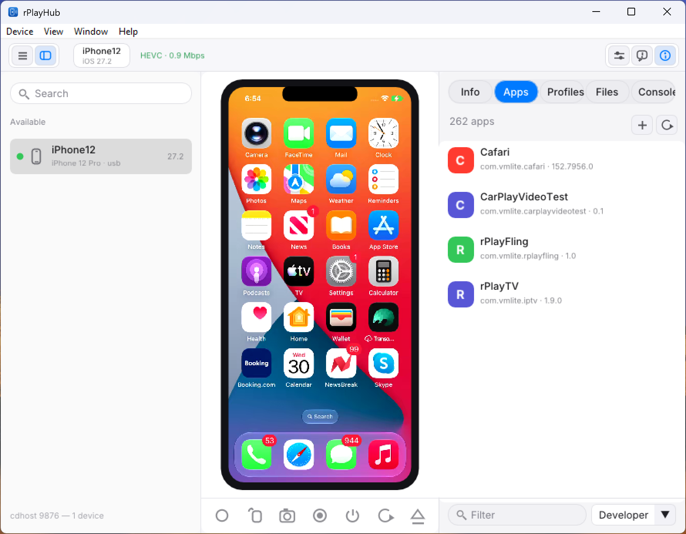

# rPlayHub on Windows



The Windows client brings the Dear ImGui + SDL2 native GUI to Windows, using MSVC and the RVRA-patched FFmpeg decoder to display and control iOS devices.

## Requirements

- Windows 10 or 11 (64-bit)
- MSVC (Visual Studio 2022 or Build Tools with C++ workload)
- CMake (optional, standard build generator)

## Building the GUI from Source

1. **Fetch GUI dependencies (Dear ImGui, nlohmann/json, SDL2 VC):**

   ```powershell
   powershell -ExecutionPolicy Bypass -File scripts\fetch-gui-deps-win.ps1
   ```

2. **Build RVRA-patched FFmpeg:**

   Build FFmpeg with the Apple RVRA in-sequence resolution adaptation patch (`patches/ffmpeg-rvra.patch`):

   ```bash
   # In MSYS2 or bash with MSVC environment enabled:
   ./scripts/build-ffmpeg-msvc.sh
   ```

3. **Build the GUI (`rplay-gui.exe`):**

   You can build directly with the MSVC batch script:

   ```cmd
   .\scripts\build-gui-msvc.bat
   ```

   Or via CMake:

   ```cmd
   cmake -B build -S client-c
   cmake --build build --config Release
   ```

## Running the Engine & GUI

1. **Start the Engine Daemon (`cdhost.exe`):**

   The engine runs with non-root userspace networking (`lwIP`) over the USB CoreDevice tunnel:

   ```powershell
   $env:RPLAY_USERSPACE_NET = "1"
   $env:RPLAY_DDI = "$PWD\deps\iOS_DDI"
   .\host-c\cdhost.exe
   ```

2. **Launch the GUI (`rplay-gui.exe`):**

   ```powershell
   .\client-c\rplay-gui.exe
   ```

   Command-line options:
   ```text
   rplay-gui [-h host] [-p video_port] [-A api_port] [--no-audio] [-r 0|1] [-scale F] [--system-titlebar] [--auto-connect]
   ```
