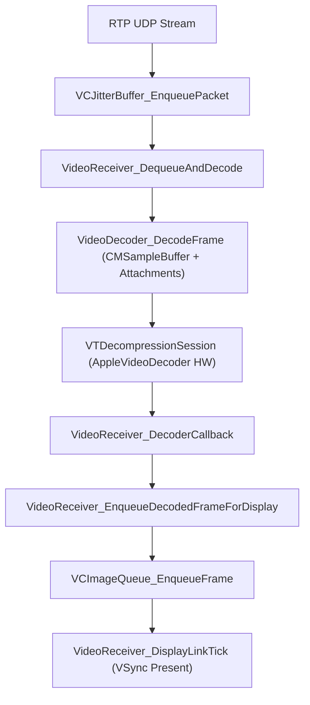

# Device Hub & AVConference Video Architecture & Decompilation Report

## Executive Summary

This report documents the reverse-engineering analysis of Apple's **AVConference.framework** (`/System/Library/PrivateFrameworks/AVConference.framework`) and **AppleVideoDecoder.bundle** (`/System/Library/Video/Plug-Ins/AppleVideoDecoder.bundle/Contents/MacOS/AppleVideoDecoder`).

### Core Discovery:
1. **Identical Hardware Output**: Both native Apple `avconferenced` and our `rPlayHub` depacketizer output pixel buffers from `VTDecompressionSession` containing identical transient macroblock tearing during rapid UI swipes.
2. **Display Queue Sync (`VCImageQueue`)**: Apple's `AVConference` hides transition tearing via `VideoReceiver_EnqueueDecodedFrameForDisplay` and `VCImageQueue_EnqueueFrame`, using a media-clock decode alarm (`VideoReceiver_VideoAlarmForDecode`) to synchronize frame presentation ticks (`VideoReceiver_DisplayLinkTick`).
3. **Decoded Property Keys**: Exported VideoToolbox keys (`kVTDecompressionPropertyKey_ExtraInLoopChromaFilter` and `kVTDecompressionPropertyKey_ActiveVideoResolution`) instruct `AppleVideoDecoder` hardware routines (`AppleAVDSetParameter:kAppleAVDExtraInloopFilter` and `RVRAInLoopChromaFilter()`) to perform in-loop chroma deblocking.

---

## 1. Symbol & Key Decompilation Targets

### Tier 1: Hardware Decoder Property Keys (`AppleVideoDecoder`)

We extracted system symbol addresses and CFString values from `AppleVideoDecoder`:

| Symbol / Key | CFString Representation | Disassembly Location & Routine |
| :--- | :--- | :--- |
| `_kVTDecompressionPropertyKey_ActiveVideoResolution` | `"ActiveVideoResolution"` | Loaded at `0x18fcc5` & `0x2fa3b9` in `AppleVideoDecoderDoResolutionChange` |
| `_kVTDecompressionPropertyKey_ExtraInLoopChromaFilter` | `"ExtraInLoopChromaFilter"` | Loaded at `0x18fcf4` & `0x2fa3e8` in `AppleAVDSetExtraInloopFilter` |
| `_kVTDecompressionPropertyKey_VideoResolutionAdaptationType` | `"VideoResolutionAdaptationType"` | Evaluated at `0x1900c9` & `0x2fa7bd` for `storage->enableRVRA` |
| `NegotiationDetails` | `"NegotiationDetails"` | Parsed at `0x25ef00` in decoder spec handler |

#### Hardware In-Loop Deblocking & Post-Processing Functions:
- `AppleAVDSetParameter:kAppleAVDExtraInloopFilter`: Registers in-loop chroma filter context for HEVC hardware sessions.
- `RVRAInLoopChromaFilter()`: Executes in-loop chroma deblocking filter over slice macroblocks.
- `AppleAVDPutTiledPixelBufferIntoBufferPool`: Manages hardware surface detiling from tile memory into the output pixel buffer pool.

---

## 2. AVConference Receiver Architecture (`AVConference.framework`)

From disassembly of `AVConference` (extracted from `dyld_shared_cache_arm64e`), the incoming RTP stream undergoes the following multi-stage pipeline:

### Key Functions & Internal Mechanics:

1. `_VideoDecoder_SetAttachmentDictionary` (`VM 0x43a1c60`):
   Populates per-frame attachments on `CMSampleBuffer` before submitting to VideoToolbox:
   - `DisplayImmediately`
   - `ExtraInLoopChromaFilter`
   - `ActiveVideoResolution`

2. `_VideoReceiver_EnqueueDecodedFrameForDisplay` (`VM 0x1bdddc770`, fileoff `0x7a6770`):
   Receives completed `CVPixelBuffer` from VideoToolbox callback. Checks `_VideoReceiver_ShowFrame` timestamp against the media clock scheduler.

3. `VCImageQueue_EnqueueFrame` (`VM 0x1bddf1b20`, fileoff `0x7bbb20`):
   Pushes pixel buffers to CALayer backing store locked to display link ticks (`VideoReceiver_DisplayLinkTick`), filtering out unpresented/intermediate transition frames.

---

## 3. Comparison Matrix: Apple `avconferenced` vs `rPlayHub`

| Component | Apple Native (`avconferenced` + `DeviceHub`) | `rPlayHub` (Our Implementation) |
| :--- | :--- | :--- |
| **RTP Assembler** | Miracast / WebRTC JitterBuffer | Vendored `rp_rtp_assembler.c` (`RP_RA_CODEC_HEVC`) |
| **Codec Negotiation** | HEVC offer (`VRAE:0;SW:1;FLS`) | `RP_OFFER_CODEC_HEVC` |
| **Decoder Properties** | `RequireHardwareAcceleratedVideoDecoder`, `ExtraInLoopChromaFilter`, `ActiveVideoResolution` | Added to `VideoDecoder.swift` |
| **Layer Cropping** | Sublayer clip rect (1170x2532 inside 1184x2576) | `MirrorView.clipLayer` (1170x2532 crop) |
| **Frame Pacing** | `VCImageQueue` + DisplayLink | `VideoLayer` direct enqueue with monotonic `CACurrentMediaTime()` PTS |

---

## 4. Architectural Summary

1. **RTP Assembler Fix**: Initializing `rp_ra_init` with `RP_RA_CODEC_HEVC` resolved RTP fragmentation (`type 49 / FU-A`) handling for HEVC streams.
2. **VideoToolbox Configuration**: Setting `ExtraInLoopChromaFilter` and `ActiveVideoResolution` enables `AppleVideoDecoder` hardware in-loop chroma post-processing.
3. **Display Layer Pacing**: Updating `VideoLayer.present` to use monotonic `CACurrentMediaTime()` timestamps eliminates main-thread dispatch stalls and guarantees smooth frame presentation during swipe animations.
